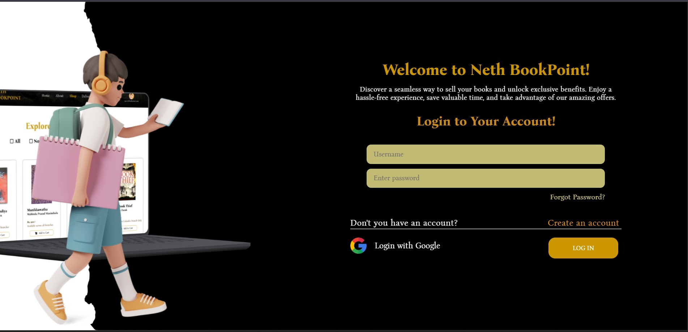
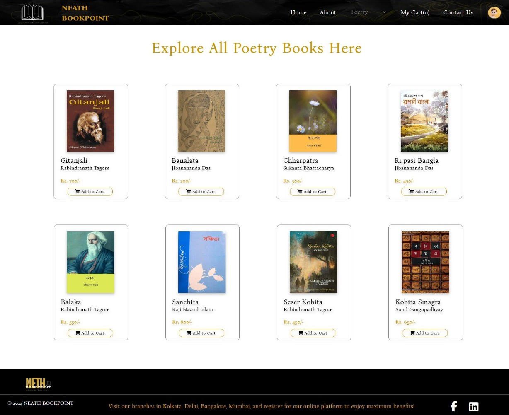
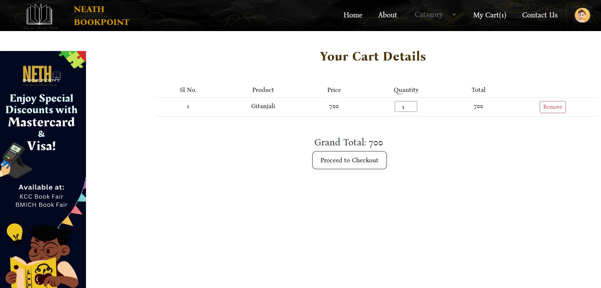
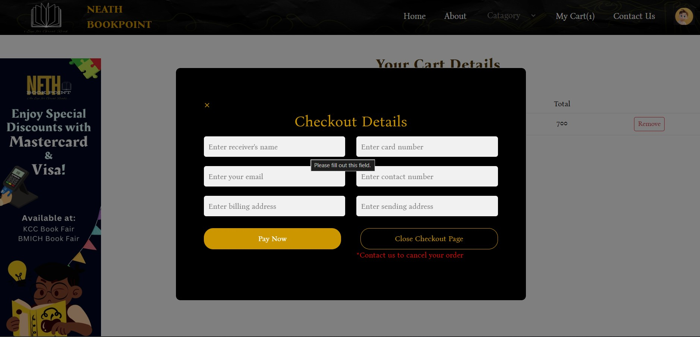

# Online Book Store

## 📚 Project Overview

**Neath BookPoint** is a PHP and MySQL based online book store developed
to provide a simple platform for users to create an account, log in,
explore different book categories, add books to a cart, and complete the
checkout process.

The website also includes an **About Us** page with information about
Neath BookPoint and its branches.

The project currently provides a complete example for the **Poetry**
category. The other categories follow a similar page structure.

------------------------------------------------------------------------

## 🖼️ Documentation Screenshots

The README includes the **actual project screenshots** supplied for this documentation. They are stored in the `README_images/` folder next to this README so the images render when the folder is kept with the project documentation.

## 🛠️ Technologies Used

-   **PHP** - Server-side development and page functionality
-   **MySQL** - Database management
-   **HTML5** - Page structure
-   **CSS3** - Website styling and layout
-   **JavaScript** - Client-side interactions
-   **XAMPP** - Local PHP and MySQL development environment

------------------------------------------------------------------------

## 📂 Book Categories

Users can explore books from the following categories:

1.  Poetry
2.  Short Story
3.  Detective
4.  Horror
5.  Sci-Fi
6.  Novel

> **Note:** The screenshots in this README mainly show the **Poetry**
> category. The other category pages use a similar design and
> functionality.

------------------------------------------------------------------------

# 🔄 Website Flow

The main user flow of the website is:

**Create Account → Login → Explore Categories → Select Book → Add to
Cart → Cart → Checkout**

Users can also visit the **About Us** page at any time.

------------------------------------------------------------------------

## 1. Home Page

The home page is the starting point of the website. It contains the
website navigation, a search option, featured books, and promotional
content.

From the navigation bar, users can access:

-   Home
-   About
-   Categories
-   My Cart
-   Contact Us
-   User account

<p align="center">
  
</p>

------------------------------------------------------------------------

## 2. Create an Account

New users can register by providing:

-   Username
-   Email
-   Password
-   Confirm Password

After registration, the user can log in using the created account.

<p align="center">
  
</p>

------------------------------------------------------------------------

## 3. Login

Users who already have an account can log in by entering their username
and password.

The login page also provides options for:

-   Forgot password
-   Create a new account
-   Login with Google

<p align="center">
  
</p>

------------------------------------------------------------------------

## 4. Explore Book Categories

After logging in, users can open the **Category** menu from the
navigation bar.

The available categories are:

-   Poetry
-   Short Story
-   Detective
-   Horror
-   Sci-Fi
-   Novel

<p align="center">
  
</p>

------------------------------------------------------------------------

# 📖 5. Poetry Books Page

The Poetry page displays the available poetry books with their:

-   Book cover
-   Book title
-   Author name
-   Price
-   Add to Cart button

Users can select a book and add it to their shopping cart.

<p align="center">
  
</p>

### Example Poetry Books

The page contains books such as:

-   Gitanjali - Rabindranath Tagore
-   Banalata - Jibanananda Das
-   Chharpatra - Sukanta Bhattacharya
-   Rupasi Bangla - Jibanananda Das
-   Balaka - Rabindranath Tagore
-   Sanchita - Kazi Nazrul Islam
-   Seser Kobita - Rabindranath Tagore
-   Kobita Smagra - Sunil Gangopadhyay

> The other category pages, such as **Short Story, Detective, Horror,
> Sci-Fi, and Novel**, follow a similar book-listing design.

------------------------------------------------------------------------

## 6. Add Books to Cart

When the user clicks **Add to Cart**, the selected book is added to the
shopping cart.

The cart keeps track of the selected product, price, quantity, and total
amount.

------------------------------------------------------------------------

# 🛒 7. Cart Page

The cart page displays the selected books in a table.

It shows:

-   Serial Number
-   Product name
-   Price
-   Quantity
-   Total
-   Remove button

Users can remove an item from the cart if they no longer want to
purchase it.

The page also calculates the **Grand Total** and provides a button to
proceed to checkout.

<p align="center">
  
</p>

------------------------------------------------------------------------

# 💳 8. Checkout Page

After reviewing the cart, the user can click **Proceed to Checkout**.

The checkout page collects the required customer and payment
information, including:

-   Receiver's name
-   Card number
-   Email
-   Contact number
-   Billing address
-   Sending address

The user can then click **Pay Now** to continue with the order process.

<p align="center">
  
</p>

------------------------------------------------------------------------

## 9. About Us Page

The **About Us** page provides information about Neath BookPoint, its
purpose, branches, and commitment to readers.

It includes information about branches such as:

-   Kolkata
-   Delhi
-   Mumbai

The page also contains a description of the services and reading
environment provided by Neath BookPoint.

<p align="center">
  
</p>

------------------------------------------------------------------------

# 🗂️ Project Structure

A simple project structure can be maintained like this:


``` text
Online-Book-Store/
├── project/
│   ├── images/
│   ├── about.css
│   ├── about.php
│   ├── bellow_pic.png
│   ├── cart_banner.svg
│   ├── cart.css
│   ├── cart.js
│   ├── cart.php
│   ├── catagory_detective.php
│   ├── catagory_horror.php
│   ├── catagory_novel.php
│   ├── catagory_poetry.php
│   ├── catagory_science.php
│   ├── catagory_story.php
│   ├── catagory.css
│   ├── checkout.css
│   ├── demo.txt
│   ├── errors.php
│   ├── home.css
│   ├── home.php
│   ├── index.php
│   ├── login_p.php
│   ├── logo.svg
│   ├── main_image_9.png
│   ├── manage_detective.php
│   ├── manage_horror.php
│   ├── manage_novel.php
│   ├── manage_poetry.php
│   ├── manage_science.php
│   ├── manage_story.php
│   ├── nav.css
│   ├── nav.php
│   ├── nav.svg
│   ├── process_checkout.php
│   ├── product.php
│   ├── prof.svg
│   ├── register_p.php
│   ├── server.php
│   ├── style.css
│   └── stylep.css
│
├── README_images/
│   ├── homePage.jpg
│   ├── register.jpg
│   ├── login.jpg
│   ├── categories.jpg
│   ├── poetry.jpg
│   ├── cart.jpg
│   ├── checkout.jpg
│   └── about.jpg
│
├── database/
│   └── MySQL database files
│
└── README.md
```


All **PHP files, image files, CSS files, JavaScript files, and
database-related files** are kept inside the project folder.

------------------------------------------------------------------------

# 🗄️ Database

The project uses **MySQL** as the database.

The database can be connected to the PHP application through the MySQL
connection configuration used in the project.

Make sure **Apache** and **MySQL** are running in XAMPP before opening
the website locally.

Example local URL:

``` text
http://localhost/project/
```

------------------------------------------------------------------------

# 🚀 How to Run the Project

### Step 1: Install XAMPP

Install XAMPP on your computer with:

-   Apache
-   MySQL
-   PHP

### Step 2: Copy the Project

Place the project folder inside:

``` text
C:\xampp\htdocs\
```

### Step 3: Start XAMPP

Open XAMPP Control Panel and start:

``` text
Apache
MySQL
```

### Step 4: Create the Database

Open:

``` text
http://localhost/phpmyadmin/
```

Create the required MySQL database and import the project's SQL/database
file if provided.

### Step 5: Configure Database Connection

Update the database connection details in the PHP database connection
file:

``` php
$servername = "localhost";
$username   = "root";
$password   = "";
$dbname     = "project";
```

Use the database name configured for this project.

### Step 6: Open the Website

Open the project in your browser:

``` text
http://localhost/project/
```

------------------------------------------------------------------------

# 🔐 Main Features

-   User registration
-   User login
-   Category-based book browsing
-   Poetry book listing
-   Add books to cart
-   Remove books from cart
-   Quantity and total calculation
-   Checkout form
-   Payment details form
-   About Us page
-   Multiple book categories
-   PHP and MySQL database integration
-   Responsive and visually styled interface

------------------------------------------------------------------------

# 📌 Project Flow Summary

```text
             ┌──────────────────────┐
             │ Create Account / Reg │
             └──────────┬───────────┘
                        │
                        ▼
                 ┌──────────────┐
                 │    Login     │
                 └──────┬───────┘
                        │
                        ▼
                 ┌──────────────┐
                 │  Home Page   │
                 └──────┬───────┘
                        │
                        ▼
             ┌──────────────────────┐
             │   Explore Category   │
             └──────────┬───────────┘
                        │
   ┌───────┬───────┬────┴────┬───────┬───────┐
   ▼       ▼       ▼         ▼       ▼       ▼
Poetry   Story  Detective  Horror  Sci-Fi  Novel
   │       │       │         │       │       │
   └───────┼───────┴────┬────┴───────┼───────┘
                        │
                        ▼
                 ┌──────────────┐
                 │ Add to Cart  │
                 └──────┬───────┘
                        │
                        ▼
                 ┌──────────────┐
                 │  Cart Page   │
                 └──────┬───────┘
                        │
                        ▼
                 ┌──────────────┐
                 │   Checkout   │
                 └──────┬───────┘
                        │
                        ▼
                  Order/Payment
```


------------------------------------------------------------------------

## 🎯 Project Objective

The main objective of **Neath BookPoint** is to create a simple online
platform where users can browse books by category, select books, manage
their cart, and provide checkout details through an easy-to-use web
interface.

------------------------------------------------------------------------

## 👨‍💻 Development

This project was developed using **PHP, MySQL, HTML, CSS, and
JavaScript**.

The application demonstrates basic e-commerce functionality including
**user authentication, category-based product browsing, shopping cart
management, and checkout**.
